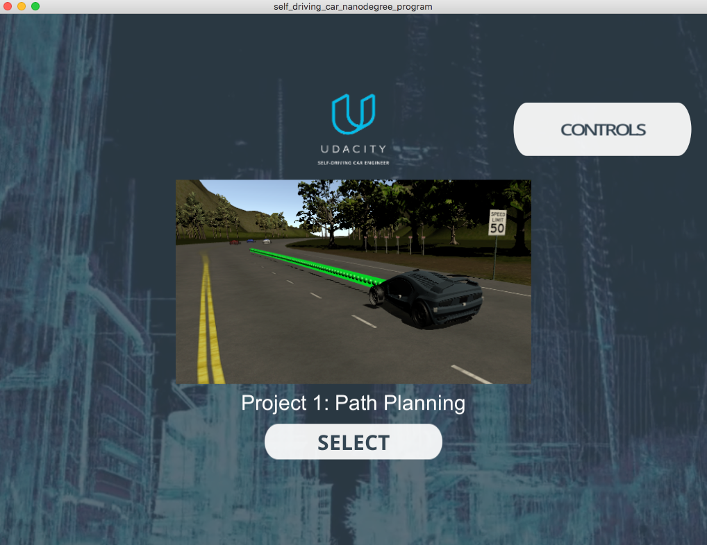

# Path Planning Project

## Overview

### Goal

- The goal of this project is to safely navigate around a virtual highway with other traffic that is driving +-10 MPH of the 50 MPH speed limit. （尽可能频繁地满足50MPH ～= 25m/s。）

- **Localization**、**Sensor Fusion data**、**A Sparse map list of waypoints** around the highway are provided.

- The car should be able to make one complete loop around the 6946m highway which takes a little around 5 mins. （至少完成一圈耗时约5分钟的6946米的行驶。）

- The car should avoid hitting other cars.（碰撞避免。）

- Acceleration <= 10 m/s^2（每2秒计算1次）

  Jerk <= 10 m/s^3（每1秒计算1次）

  AccN（转向时的向心加速度：转向越快 AccN越高）

### Details

- The vehicle moves to a new waypoint every 20ms（每20ms/0.02s 移动至新的点）**cycle = 20ms**
- The vehicle moves 50 frames/times per second（每秒移动50次）

- #### Highway Map（公路图）

  - `data/highway_map.csv`
  - Each waypoint in the list contains `[x,y,s,dx,dy]` values.（每个航路点都有一个（x，y）全局地图位置，以及一个Frenet s值和Frenet d单位法向矢量（分为x分量dx和y分量dy）。）
  - s值是沿道路方向的距离。第一个航点的s值为0，因为它是起点。distance along the road, goes from 0 to 6945.554.
  - Lane width = 4m. 高速公路共有6条车道，每个方向3条车道。 每个车道为4 m宽，并且汽车只能位于右侧3个车道之一中。 除非更改车道，否则汽车应始终在车道内。

- #### Main car's Localization Data

  - ["x"] The car's x position in map coordinates
  - ["y"] The car's y position in map coordinates
  - ["s"] The car's s position in frenet coordinates
  - ["d"] The car's d position in frenet coordinates
  - ["yaw"] The car's yaw angle in the map
  - ["speed"] The car's speed in MPH

- #### Previous path data given to the Planner（smooth transition）

  - Return the **previous list** but with processed points removed, can be a nice tool to show how far along the path has processed since last time.
  - ["previous_path_x"] The previous **list** of x points previously given to the simulator
  - ["previous_path_y"] The previous **list** of y points previously given to the simulator

- #### Previous path's end s and d values

  - ["end_path_s"] The previous list's last **point**'s frenet s value
  - ["end_path_d"] The previous list's last **point**'s frenet d value

- #### Sensor Fusion Data, a list of all other car's attributes on the same side of the road.

  - ["sensor_fusion"] A **2d vector of cars** and then that car's 

    `[id，x，y，vx，vy，s，d]`（均为全球变量global variables）

    [car's unique ID, car's x position in map coordinates, car's y position in map coordinates, car's x velocity in m/s, car's y velocity in m/s, car's s position in frenet coordinates, car's d position in frenet coordinates].

  - `vx`，`vy`值可用于预测未来的汽车位置。 例如，假设被跟踪的汽车沿道路行驶，那么其未来的Frenet预测值将是其当前的s值加上其（已转换的）总速度（m / s）乘以未来经过的时间。


## Prerequisites

### Dependencies 

- cmake >= 3.5

- make >= 4.1

- gcc/g++ >= 5.4

- libuv 1.12.0

- uWebSockets

  - The communication between the simulator and the path planner is done using WebSocket. The path planner uses the uWebSockets WebSocket implementation to handle this communication.

  - Run `install-mac.sh` if your device is Mac OS

  - If you install from source, checkout to commit `e94b6e1`, i.e.

    ```shell
    git clone https://github.com/uWebSockets/uWebSockets 
    cd uWebSockets
    git checkout e94b6e1
    ```

- Provided simulator downloaded from the [release tab](https://github.com/udacity/self-driving-car-sim/releases/tag/T3_v1.2).

### Usage

1. Clone this repo.

2. Make a build directory: `mkdir build && cd build`

3. Compile: `cmake .. && make`

4. Run: `./path_planning`.

   ```shell
   > cd build
   > ./path_planning
   Listening to port 4567
   ```

5. Open the simulator and Click `select`to monitor the virtual environment.



#### 

## Implementation

### Prediction

1. This part of the code deals with the localization and sensor fusion data. It intents to reason about the environment. In the case, we concern about following three aspects :

   处理来自定位及传感器融合的数据。

- Whether there is a car in front of us blocking the traffic.

  （前方是否有车阻挡交通。）

- Whether there is a car to the right of us making a lane change which is not safe.

   （右侧是否有不安全的车辆在进行变道。）

- Is there a car to the left of us making a lane change not safe which is not safe.

   （左侧是否有不安全的车辆在进行变道。）

2. It is solved by calculating the lane each other car lies and the position it will occur at the end of the last planned trajectory. 

   通过previous path计算每一个车道上的其他车辆的轨迹及其end point。

3. A car is considered as "dangerous" when its distance to ego car is less than 30 meters ahead or behind us.

   当汽车在我们前面或后面的距离小于30米时，将被认为是“危险”的。
   
   ```c++
   bool car_ahead = false;
   bool car_left = false;
   bool car_right = false;
   
   for (int i=0; i<sensor_fusion.size(); i++){
   		float d = sensor_fusion[i][6];
       int car_lane = -1;
       
       // whether this car is on the same lane that ego vehicle drives on         
       if (d > 0 && d < 4){
       		car_lane = 0;
   		} else if (d > 4 && d < 8){
       		car_lane = 1;
       } else if (d > 8 && d < 12){
       		car_lane = 2;
       } 
   
   		if (car_lane < 0){
   				continue;
   		}
   
   		// grab car's speed
   		double vx = sensor_fusion[i][3];
       double vy = sensor_fusion[i][4];
       double check_speed = sqrt(vx*vx + vy*vy);
       double check_car_s = sensor_fusion[i][5]; //car's s position in frenet coordinates
       // Estimate car's position after executing previous trajectory.
       // 查看车辆的未来位置
       check_car_s += ((double)prev_size * 0.02 * check_speed);
   
       if ( car_lane == lane ) {
           // Car on the same lane.
           car_ahead |= ((check_car_s > car_s) && (check_car_s - car_s < 30));
           } else if ( (car_lane - lane) == -1 ) {
           // Car on the left lane.
           car_left |= ((car_s - 30 < check_car_s) && (car_s + 30 > check_car_s));
           } else if ( (car_lane - lane) == 1 ) {
           // Car on the right lane.
           car_right |= ((car_s - 30 < check_car_s) && (car_s + 30 > check_car_s));
       }
   }
   ```
   
   

### Behavior

1. This part deals with the problem: **"Which behavior should we take if there is a car in front"**

- Change lane

- Speed up

- Slow down

2. `speed_diff` variable is defined for speed changes while generating the trajectory.（`speed_diff` 在生成轨迹时用于速度更改。 ）

3. This approach helps the car to respond the changing situations fast and efficiently. eg. The ego car will decelerate if there is a car ahead with the distance away less than 30m to avoid collision.

   （反应更迅速和高效，例如当前方距离小于30米处有车辆时，自车将会采取减速以避免碰撞。）
   
   ```c++
   // Behavior: take action (change lane/speed up/slow down/) approaching the car ahead.
   double speed_diff = 0;
   const double MAX_SPEED = 49.5;
   const double MAX_ACC = .224;
   
   if (car_ahead){
   		// if there is a car ahead
     	if (!car_left && lane > 0){
       		// if there is no car left and there is a left lane
       		lane--; // change to left lane
     	} else if (!car_right && lane !=2){
      		 	// if there is no car right and there is right lane
       		lane++; // change to right lane
     	} else {
       		speed_diff -= MAX_ACC;
     	}
   } else {
     	// if there is no car ahead
     	if (lane != 1){
       		// if the ego car is not on the middle lane
       		if ((lane==0 && !car_right) || (lane==2 && !car_left)){
         			// 1.if the ego car is on the left lane and there is no car right
         			// 2.if the ego car is on the right lane and there is no car left
         			lane =1; // change back to the middle lane
       		}
     	}
     	if (ref_vel < MAX_SPEED){
       		speed_diff += MAX_ACC;
     	}
   }
   ```
   
   


### Trajectory

1. This part calculates the trajectory based on the **speed** and **lane** output from the *behavior*, localization and *previous path points*.

   从行为决策，定位，预测中获得速度与车道信息，生成运行轨迹。

2. The last two points of the previous trajectory (or the car position if there are no previous trajectory) are used in conjunction three points at a far distance to initialize the spline calculation. To make the work less complicated to the spline calculation based on those points, the coordinates are transformed (shift and rotation) to local car coordinates .

   首先，将前一条轨迹的最后两个点（如果前一轨迹的点不够，则为「自车位置+前一位置」）与远处的三个点结合使用以初始化样条曲线spline。 为了使基于这些点的样条线计算工作更简单，将坐标转换（移动和旋转）为汽车坐标。

   ```c++
   // Create a list of widely space(x, y) waypoints, evenly spaced at 30m
   // Later we will interpolate these waypoints with a spline
   // 存储5个waypoints：2个来自previous path；3个来自接下来的30m, 60m, 90m
   // 利用这5个waypoints构建spline曲线
   vector<double> ptsx;  
   vector<double> ptsy;
   
   // reference x, y, yaw
   // either we will reference the starting point as where the car is  
   // or at the previous points end point
   double ref_x = car_x;
   double ref_y = car_y;
   double ref_yaw = deg2rad(car_yaw);
   
   // if previous size is almost empty, use the car as starting reference
   // 如果previous points不够，那么则用当前的位置通过ref_yaw来逆推出prev_car_x, prev_car_y
   // 并与car_x, car_y一同加入ptsx和ptsy 作为previous points
   if (prev_size < 2){
     	// use two points that make the path tangent（相切） to the car
     	double prev_car_x = car_x - cos(car_yaw);
     	double prev_car_y = car_y - sin(car_yaw);
     
     	ptsx.push_back(prev_car_x);
     	ptsx.push_back(car_x);
     
     	ptsy.push_back(prev_car_y);
     	ptsy.push_back(car_y);
   } else {
       // redifine reference states as previous path end point
       // 如果previous points >= 2，那么将最近的2个points加入进来
       // 同时更新ref_yaw角度，并以此作为new planning path的starting positions
       ref_x = previous_path_x[prev_size-1];
       ref_y = previous_path_y[prev_size-1];
   
       double ref_x_prev = previous_path_x[prev_size - 2];
       double ref_y_prev = previous_path_y[prev_size - 2];
       ref_yaw = atan2(ref_y-ref_y_prev, ref_x-ref_x_prev);
   
       // use two points that make the path tangent（相切） to the car
       ptsx.push_back(ref_x_prev);
       ptsx.push_back(ref_x);
   
       ptsy.push_back(ref_y_prev);
       ptsy.push_back(ref_y);
   }
   ```

   

   In Frenet add evenly(均匀地) 30m spaced points ahead of the starting reference,
   and then transform to global coordinate.

   在Frenet坐标系下，均匀地加入前方30m、60m、90m的waypoints，并转换为Global全局坐标。

   ```C++
   vector<double> next_wp0 = getXY(car_s + 30, 2 + 4*lane, map_waypoints_s, map_waypoints_x, map_waypoints_y);
   vector<double> next_wp1 = getXY(car_s + 60, 2 + 4*lane, map_waypoints_s, map_waypoints_x, map_waypoints_y);
   vector<double> next_wp2 = getXY(car_s + 90, 2 + 4*lane, map_waypoints_s, map_waypoints_x, map_waypoints_y);
   
   ptsx.push_back(next_wp0[0]);
   ptsx.push_back(next_wp1[0]);
   ptsx.push_back(next_wp2[0]);
   
   ptsy.push_back(next_wp0[1]);
   ptsy.push_back(next_wp1[1]);
   ptsy.push_back(next_wp2[1]);
   
   // Transform to local car coordinates.
   for ( int i = 0; i < ptsx.size(); i++ ) {
     	// shift car reference angle to 0 degree
     	double shift_x = ptsx[i] - ref_x;
     	double shift_y = ptsy[i] - ref_y;
   
     	ptsx[i] = shift_x * cos(0 - ref_yaw) - shift_y * sin(0 - ref_yaw);
     	ptsy[i] = shift_x * sin(0 - ref_yaw) + shift_y * cos(0 - ref_yaw);
   }
   ```

   Note: The conversion from **global coordinates to local coordinates** derives from the graph and formula below.

   绿色为自车坐标，黑色为全局坐标。

   

   

3. In order to ensure more continuity on the trajectory, all of the previous trajectory points are copied to the new trajectory. The rest points are calculated by evaluating the **spline** and transforming the output coordinates to global coordinates.  Note that the change of velocity is determined by the behavior in order to increase/decrease speed on every single trajectory point instead of the entire trajectory.

   为了确保在轨迹上具有更大的连续性，将所有先前的轨迹点复制到新轨迹上。 通过评估**spline样条曲线**来计算剩余点，并转换为全局坐标。 同时，速度的变化由行为决策决定，以便在每个单个轨迹点而不是整个轨迹上增加/减小速度。

   

   ```c++
   // Create a spline
   tk::spline s;
   
   // set (x,y) points to the spline
   // 利用pts里的5个waypoints构建一条spline样条曲线
   s.set_points(ptsx, ptsy);
   
   // Define the actual(x, y) points in global coordinates used for the planner
   // from previous path for continuity
   vector<double> next_x_vals;
   vector<double> next_y_vals;
   
   // Start with all of the previous path points from last time
   // 将全部的previous points（<=50个）加入到next_vals中          
   for (int i=0; i<previous_path_x.size(); i++){
     	next_x_vals.push_back(previous_path_x[i]);  
    		next_y_vals.push_back(previous_path_y[i]);
   }
   
   // Calculate how to break up spline points so that travelling at the desired reference velocity
   // Calculate distance y position 30m ahead
   // spline曲线由相隔较远的5个waypoints构成，在此利用该spline计算local坐标系下接下来30m的轨迹
   // 每0.02秒为一个时间间隔计算出30m内每一个小间隔的x值以及对应的spline(x)值          // 最后转换为global coordinates
   double target_x = 30.0;
   double target_y = s(target_x);
   double target_dist = sqrt(target_x*target_x + target_y*target_y);
   
   double x_add_on = 0;
   
   // Fill up the rest of the path planner after filling it with previous points
   for (int i=1; i<50-prev_size; i++){
     	ref_vel += speed_diff;
     	if (ref_vel > MAX_SPEED){
         	ref_vel = MAX_SPEED;
       } else if (ref_vel < MAX_ACC){
         	ref_vel = MAX_ACC;
       }
   
       // Calculate N, x_point, y_point
       double N = target_dist/(0.02*ref_vel/2.24);
       double x_point = x_add_on + target_x/N;
       double y_point = s(x_point);
   
       x_add_on = x_point;
   
       double x_ref = x_point;
       double y_ref = y_point;
   
       // Transform back to global coordinates
       x_point = x_ref * cos(ref_yaw) - y_ref * sin(ref_yaw);
       y_point = x_ref * sin(ref_yaw) + y_ref * cos(ref_yaw);
   
       x_point += ref_x;
       y_point += ref_y;
   
       next_x_vals.push_back(x_point);
       next_y_vals.push_back(y_point);
   }
   ```

   Note: The conversion from **local coordinates to global coordinates** derives from the graph and formula below.

   绿色为自车坐标，黑色为全局坐标。

   

   


## Performance

### The car is able to drive 4 miles without accident


The simulator ran 4 miles around 6 minutes without any accident.

### The car drives according to the Speed limit.

No speed limit red warning happened.

### Max Acceleration and Jerk are not exceeded.

No acceleration and jerk warning happened.

### The car does not have collisions.

No collisions happened.

### The car is able to change lanes.

The car kept driving on its lane most of the time, but it was also able to change lanes in terms of traffic situations. For example, there is a a car ahead driving slowly, and it is safe to change lanes if the distance away from other cars is large enough (>=30m).


## Conclusion

It is possible to drive without difficulty even with fairly dense traffic, and according to the designed cost, when there is a safe path that guarantees a better speed, the vehicle travels as close to max_speed as possible through lane change if there is slow vehicle ahead. 