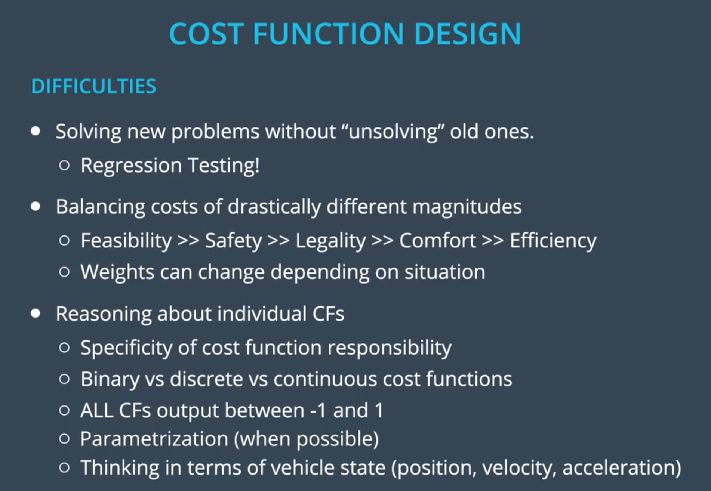

# Behavior Planning

## 1.OVERVIEW

## 2.STRENGTHS VS WEAKNESS

（有限状态机的优缺点）

## 3.INPUTS

（状态方程的输入）

## 4.Behavior Planning Pseudocode

    def transition_function(predictions, current_fsm_state, current_pose, cost_functions, weights):
    # only consider states which can be reached from current FSM state.
    possible_successor_states = successor_states(current_fsm_state)
    
    # keep track of the total cost of each state.
    costs = []
    for state in possible_successor_states:
        # generate a rough idea of what trajectory we would
        # follow IF we chose this state.
        trajectory_for_state = generate_trajectory(state, current_pose, predictions)
    
        # calculate the "cost" associated with that trajectory.
        cost_for_state = 0
        for i in range(len(cost_functions)) :
            # apply each cost function to the generated trajectory
            cost_function = cost_functions[i]
            cost_for_cost_function = cost_function(trajectory_for_state, predictions)
    
            # multiply the cost by the associated weight
            weight = weights[i]
            cost_for_state += weight * cost_for_cost_function
         costs.append({'state' : state, 'cost' : cost_for_state})
    
    # Find the minimum cost state.
    best_next_state = None
    min_cost = 9999999
    for i in range(len(possible_successor_states)):
        state = possible_successor_states[i]
        cost  = costs[i]
        if cost < min_cost:
            min_cost = cost
            best_next_state = state 
    
    return best_next_state

## 5.COST FUNCTION to choose a lane

**选择道路的损失函数（保持/变道）**

**Δs=sG−s （与目标道路上某一点Goal的直线距离）**
How much distance the vehicle will have before it has to get into the goal lane.

**Δd=dG−dLC/KL（与目标道路上某一点Goal的横向距离）**
The lateral distance between the goal lane and the options being considered. In this caseΔdKL=dG−dKL would be zero and ΔdLC=dG−dLC would not.

The cost function penalizes large ∣Δd∣ and we want that penalty to be bigger when Δs is small.
**（Δd横向距离越大，Δs纵向直线距离越小 => 越惩罚 => cost越大越接近1）**

When  `delta_d / delta_s` is big, this quantity approaches maximum cost (1) but when it's small, it approaches minimum cost (0).

## 6.COST FUNCTION to speed（速度损失函数）

* The cost decreases as both intended lane and final lane are higher speed lanes.
**（intended speed, final speed 越大 => cost 越小）**
*The cost of being out of goal lane also becomes larger as vehicle approaches goal distance.
**（ 越接近目标距离时，若目标车道=> cost 越大）**
* The cost function provides different costs for each possible behavior: KL, PLCR/PLCL, LCR/LCL.
* The values produced by the cost function are in the range 0 to  1 （value：0到1）

## 7.Design and Weight Tweaking
（损失函数的设计与调参）

难点：

1. 解决新问题时不影响旧问题。
2. 平衡各种目标量
	默认：**可行性 >> 安全性 >> 合法性 >> 舒适性 >> 效率**
	PS：权重会因不同场景而有所不同。
3. 推导每一个损失函数

