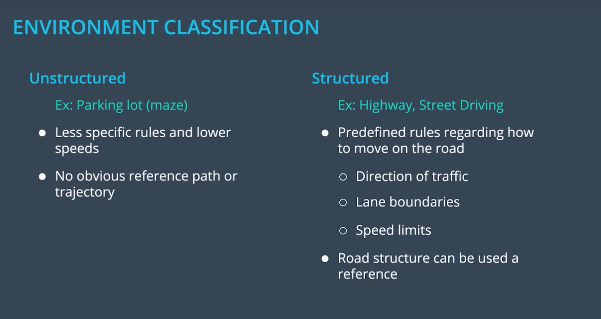
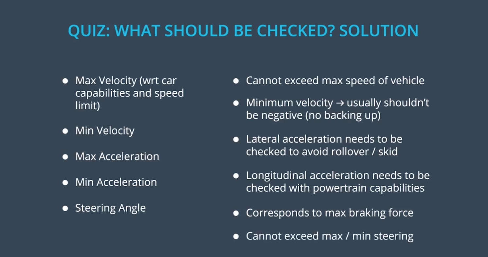

# Trajectory Generation

## 1. OVERVIEW
### 1.1 Motion Planning Problem（运动规划）


#### 配置空间
#### 给定：
- 起始配置*q_start* (来自定位模块和传感器)
	包括*车辆位置，速度，加速度*。
- 目标配置*q_goal* (来自决策模块)
	*eg. **where** to go with **which** speed*
- 约束条件（物理，地图，交通法规）
#### 问题：
- 可行的路由规划：在配置空间中找到一个*移动序列*使得车辆可以从*q_start*移动到*q_goal*，同时做到避障。


## 2. PROPERTIES（属性）

1. Completeness（是否有解）
2. Optimality（minimal cost）
 


## 3. ALGORITHM（算法）

1. Combinatorial Methods（组合法）
2. Potential Field Methods（位势场法）
		容易陷入极小值，难以找到解
3. Optimal Control（最优控制法）
		数值优化法	

***4. Sampling-based Methods（基于抽样算法)***
- Discrete methods (A*, D*, D*-lite, Dijkstra's)
- Probabilistic methods (RRT, RRT*, PRM)


### 3.1 A* 

PS：并不能保证生成的位置都是可行驶的（因为A*是离散的 不符合行驶特点）。

### 3.2 Hybrid A*

- 保证是可行驶的（Drivable），因为是*连续*的方法，牺牲了完整性（Completeness）和最优性（Optimality）。
- 效率高（High Efficiency），几乎每次都能找到不错的路径。

### 3.3 Hybrid A* in Practice
（bicycle model）


w（omega）：有关变化无关状态的变化率（heading rate of change）
v：值为正的恒定速度
L：前后轴的距离
delta：车头转向角（添加的delta越多，计算量越高，计算时间越长）

### 3.4 Hybrid A* Pseudocode
（非结构化环境中路径搜索的最佳算法之一）


``` 
def expand(state, goal):
    next_states = []
    for delta in range(-35, 40, 5): 
        # Create a trajectory with delta as the steering angle using 
        # the bicycle model:

        # ---Begin bicycle model---
        delta_rad = deg_to_rad(delta)
        omega = SPEED/LENGTH * tan(delta_rad)
        next_x = state.x + SPEED * cos(theta)
        next_y = state.y + SPEED * sin(theta)
        next_theta = normalize(state.theta + omega)
        # ---End bicycle model-----

        next_g = state.g + 1
        next_f = next_g + heuristic(next_x, next_y, goal)

        # Create a new State object with all of the "next" values.
        state = State(next_x, next_y, next_theta, next_g, next_f)
        next_states.append(state)

    return next_states
```
```
def search(grid, start, goal):
    # The opened array keeps track of the stack of States objects we are 
    # searching through.
    opened = []
    # 3D array of zeros with dimensions:
    # (NUM_THETA_CELLS, grid x size, grid y size).
    closed = [[[0 for x in range(grid[0])] for y in range(len(grid))] 
        for cell in range(NUM_THETA_CELLS)]
    # 3D array with same dimensions. Will be filled with State() objects 
    # to keep track of the path through the grid. 
    came_from = [[[0 for x in range(grid[0])] for y in range(len(grid))] 
        for cell in range(NUM_THETA_CELLS)]


    # Create new state object to start the search with.
    x = start.x
    y = start.y
    theta = start.theta
    g = 0
    f = heuristic(start.x, start.y, goal)
    state = State(x, y, theta, 0, f)
    opened.append(state)

    # The range from 0 to 2pi has been discretized into NUM_THETA_CELLS cells. 
    # Here, theta_to_stack_number returns the cell that theta belongs to. 
    # Smaller thetas (close to 0 when normalized  into the range from 0 to 
    # 2pi) have lower stack numbers, and larger thetas (close to 2pi when 
    # normalized) have larger stack numbers.
    stack_num = theta_to_stack_number(state.theta)
    closed[stack_num][index(state.x)][index(state.y)] = 1

    # Store our starting state. For other states, we will store the previous 
    # state in the path, but the starting state has no previous.
    came_from[stack_num][index(state.x)][index(state.y)] = state

    # While there are still states to explore:
    while opened:
        # Sort the states by f-value and start search using the state with the 
        # lowest f-value. This is crucial to the A* algorithm; the f-value 
        # improves search efficiency by indicating where to look first.
        opened.sort(key=lambda state:state.f)
        current = opened.pop(0)

        # Check if the x and y coordinates are in the same grid cell 
        # as the goal. (Note: The idx function returns the grid index for 
        # a given coordinate.)
        if (idx(current.x) == goal[0]) and (idx(current.y) == goal.y):
            # If so, the trajectory has reached the goal.
            return path
        # Otherwise, expand the current state to get a list of possible 
        # next states.
        next_states = expand(current, goal)
        for next_s in next_states:
            # If we have expanded outside the grid, skip this next_s.
            if next_s is not in the grid:
                continue
            # Otherwise, check that we haven't already visited this cell and
            # that there is not an obstacle in the grid there.
            stack_num = theta_to_stack_number(next_s.theta)
            if closed[stack_num][idx(next_s.x)][idx(next_s.y)] == 0 
                and grid[idx(next_s.x)][idx(next_s.y)] == 0:
                # The state can be added to the opened stack.
                opened.append(next_s)
                # The stack_number, idx(next_s.x), idx(next_s.y) tuple 
                # has now been visited, so it can be closed.
                closed[stack_num][idx(next_s.x)][idx(next_s.y)] = 1
                # The next_s came from the current state, and is recorded.
                came_from[stack_num][idx(next_s.x)][idx(next_s.y)] = current
```


## 4. ENVIRONMENT CLASSIFICATION（场景分类）


#### 非结构化（停车场）：
- 低速，限制少
- 并不存在明显的参考路径
#### 结构化（高速公路）：
- 按照特定规则行驶
	- 车辆行驶方向
	- 车道边界
	- 速度限制
- 道路结构自身即可作为参考路径
#### The Need for Time （时间作为第三个维度）


## 5.STRUCTURED TRAJCETORY GENERATION（结构化轨迹生成）

### 5.1 Boundary Conditions（道路边界条件）

- 颠簸（加速度的不停变化）会让人不适
- Jerk Minimization
### 5.2 Jerk Minimization


6 Coefficients => 6 Tunable Parameters => 6 Boundary Conditions


【初始位置，速度，加速度，最终位置，速度，加速度】（s：纵向；d：横向）

#### 推导公式：


### 5.3 Polynomial Trajectory Generation（多项式解算器）


### 5.4 Feasibility（可行性）

- 最大速度（车辆自身限速）
- 最小速度（倒车最低速度）
- 最大加速度（横向侧滑，纵向动力输出）
- 最小加速度（纵向制动）
- 转向角度


## 6. 基于抽样的Polynomial Trajectory

- 通过抽样大量的最终配置，在目标位置附近生出对应了Jerk Minimization的轨迹。


- 丢掉所有不可行的轨迹（边界之外，碰撞风险）。


- 排序（通过Cost Function）选择一条最优轨迹。
	- Jerk （横向的Jerk优先）
	- Distance to Obstacles
	- Distance to Center Line
	- Time to Goal
	
	

## 7. Project
### Goal
The speed goal is to have the car traveling at (but not above) the 50 MPH speed limit as often as possible. （尽可能频繁地满足50MPH ～= 25m/s）

- moves to a new waypoint every 20ms（每20ms 0.02s 移动至新的点）**cycle = 20ms** 
- moves 50 frames/times per second（每秒移动50次）

eg. points 0.5 m apart（点与点之间相隔0.5m） => a velocity of 25 m/

### Constraints
- Acceleration（每2秒计算1次，< 75m/s^2）
- Jerk（每1秒计算1次，< 10m/s^3）
- AccN（转向时的向心加速度：转向越快 AccN越高 centripetal acceleration）
- AccT （转向时的切向加速度 tangential acceleration）

### Main Method
- Minimize Acc and Jerk based on `car_speed`
- 在`main.cpp`中，我们直接将`next_x_vals`和`next_y_vals`传递给模拟器，而不是直接设置速度。 我们将这些点设置为相距0.5 m。 由于汽车每秒移动50次，因此每次移动0.5m的距离将产生25m / s的速度。 25 m / s接近50 MPH。
```
double dist_inc = 0.5;
for (int i = 0; i < 50; ++i) {
	  next_x_vals.push_back(car_x+(dist_inc*i)*cos(deg2rad(car_yaw)));
	  next_y_vals.push_back(car_y+(dist_inc*i)*sin(deg2rad(car_yaw)));
}
```
- Note: High peak in Acceleration from 0 MPH to 56 MPH in a single 20ms.（在单个20 ms帧中从0 MPH上升到56 MPH，会导致加速度峰值）


### More complex Path
```
vector<double> next_x_vals;
vector<double> next_y_vals;

double pos_x;
double pos_y;
double angle;
int path_size = previous_path_x.size();

for (int i = 0; i < path_size; ++i) {
  next_x_vals.push_back(previous_path_x[i]);
  next_y_vals.push_back(previous_path_y[i]);
}

if (path_size == 0) {
  pos_x = car_x;
  pos_y = car_y;
  angle = deg2rad(car_yaw);
} else {
  pos_x = previous_path_x[path_size-1];
  pos_y = previous_path_y[path_size-1];

  double pos_x2 = previous_path_x[path_size-2];
  double pos_y2 = previous_path_y[path_size-2];
  angle = atan2(pos_y-pos_y2,pos_x-pos_x2);
}

double dist_inc = 0.5;
for (int i = 0; i < 50-path_size; ++i) {    
  next_x_vals.push_back(pos_x+(dist_inc)*cos(angle+(i+1)*(pi()/100)));
  next_y_vals.push_back(pos_y+(dist_inc)*sin(angle+(i+1)*(pi()/100)));
  pos_x += (dist_inc)*cos(angle+(i+1)*(pi()/100));
  pos_y += (dist_inc)*sin(angle+(i+1)*(pi()/100));
}

msgJson["next_x"] = next_x_vals;
msgJson["next_y"] = next_y_vals
```

- Using Previous Path（smooth transition）
	- starts the new path with whatever previous path points were left over from the last cycle.（previous里有多少便从多少个path points开始，并不重新计算path point）
	- append new waypoints, until the new path has 50 total waypoints.（添加新的waypoints至总共50个）
	- PS：the more waypoints we use from the previous path, the less the new path will reflect dynamic changes in the environment.（previous的waypoints越多，越少反应环境的动态变化）
	- Ideally,  a few waypoints from the previous, the rest of new path based on new data from sensor fusion info.（一些来自previous，一些来自传感器融合的新数据）

- Timing
	- 在等待新生成的路径时，模拟器将继续沿其最后给定的路径继续进行下去。
	- Previous Path data becomes even more important if there is high latency.（高延迟）
   eg. There is a 500ms delay in sending a new path to the simulator. As long as the new path incorporates a sufficient length of the previous path, the transition will still be smooth.
	- Concern（难点）：保证未来1-2seconds内预测的精确度

- Setting Points Path with Latency（有延迟的路径）
	- C ++路径规划器至少要比模拟器落后一个周期，因为C ++程序无法在同一周期上接收和发送数据。 结果，Simulator收到的任何路径都是从前一个周期的角度来看的。 这可能意味着，当一条新路径到达Simulator时，车辆已经通过了该路径的前几个路点。
	- 可解决的方案：Simulator具有内置工具来处理此时序差异。 模拟器实际上期望接收到的路径与汽车的位置相比有点过时，并且模拟器会考虑接收到的路径上的哪个点最接近汽车，并进行适当调整。
	
### Highway Map（公路图）
- Highway map
	- 在`data / highway_map.csv`内部，有一个沿轨道一直行进的航路点列表。 轨迹总共包含181个航点，最后一个航点映射回第一个。 航路点位于高速公路中心的双黄分隔线的中间。
	- 赛道为6945.554米左右（约4.32英里）。 如果汽车的平均速度接近50英里/小时，则整个高速公路要花费5分钟多一点的时间。
	- 高速公路共有6条车道-每个方向3条车道。 每个车道为4 m宽，并且汽车只能位于右侧3个车道之一中。 除非更改车道，否则汽车应始终在车道内。

- Waypoint Data（航点数据）
	- 每个航路点都有一个（x，y）全局地图位置，以及一个Frenet s值和Frenet d单位法向矢量（分为x分量和y分量）。
	- s值是沿道路方向的距离。第一个航点的s值为0，因为它是起点。
	- d向量的大小为1，并且在道路的右侧指向垂直于道路的点。 d向量可用于计算车道位置。例如，如果您想在某个航路点处位于左车道，只需将航路点的（x，y）坐标与d矢量乘以2相加即可。由于车道宽4 m，因此左车道的中间位置（车道最靠近双黄线的地方是距航路点2 m。
	- 如果您想位于中间车道，请将路标坐标添加到d矢量乘以6 =（2 + 4），因为中间车道的中心距左侧车道的中心4 m距双黄分割线和航路点2 m。

- Converting Frenet Coordinates
	- A helper function, `getXY`, which takes in Frenet (s,d) coordinates and transforms them to (x,y) coordinates.
	- 该函数接受Frenet（s，d）坐标并将其转换为（x，y）坐标。

- Interpolating Points（插值点）
	- 如果需要估计已知航路点之间的点的位置，则需要*interpolate（内插）*这些点的位置。
	- 一旦有了多项式函数，就可以使用它来插值新点的位置。

### Sensor Fusion（传感器融合）
- Collision Avoidance（避免碰撞）
- `sensor_fusion`变量包含有关道路右侧的汽车的所有信息。
- 每辆汽车的数据格式为：`[id，x，y，vx，vy，s，d]`。 `id`是该车的唯一标识符。 `x`，`y`值位于全局地图坐标中，而`vx`，`vy`值是速度分量，也参考全局地图。 最后，`s`和`d`是该车的Frenet坐标。
- `vx`，`vy`值可用于预测未来的汽车位置。 例如，假设被跟踪的汽车沿道路行驶，那么其未来的Frenet预测值将是其当前的s值加上其（已转换的）总速度（m / s）乘以未来经过的时间。

### Change Lane（换道）
- 平滑地变道。每当ego vehicle接近其前方行驶速度 < speed limit速度限制的车辆时，ego vehicle should consider changing lanes应考虑更改车道。
- 只有在这样的改变是安全的情况下，并且如果改变车道将有助于其更好地通过交通流时，汽车才应改变车道。
- For safety，换道should optimize the distance away from other traffic （优化与其他交通的距离）。 
- For comfort，换道也should result in low acceleration and jerk（较低的加速度和加速度）。 Acc加速度和Jerk加速度部分可以通过s和d函数的线性方程求解。
- `Eigen-3.3库`可以求解此类线性方程。 `getXY`函数可以将`（s，d）`点转换为返回路径的`（x，y）`点。


